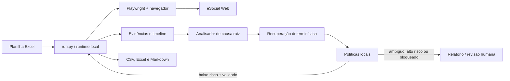
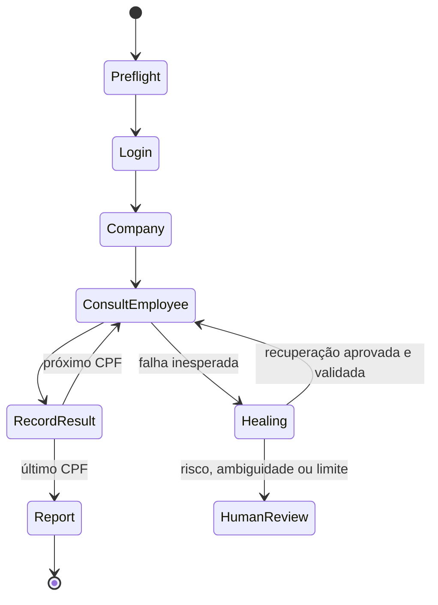

# Consulta de Ruído no eSocial — arquitetura independente

## Escopo e fronteiras

Esta automação local lê uma planilha de CPFs, consulta exclusivamente informações de SST/agentes nocivos/exposição ocupacional no eSocial Web e produz relatórios. Ela **não transmite, retifica, exclui, assina, salva ou altera dados**. Uma tela, link, botão ou texto que indique ação proibida interrompe o fluxo e gera item de revisão humana.



O `run.py` é o único processo de orquestração. Ele abre o Google Chrome em modo interativo e maximizado, usando por padrão o último perfil Chrome local, e navega diretamente para `https://login.esocial.gov.br/login.aspx`. Playwright executa interações Web previsíveis; computer use é um harness limitado a observação, captura e ações de baixo risco autorizadas pela política. Não há agente central, Portal, GitHub nem execução remota.

## Estrutura

```text
.
├── run.py                        # entrypoint mínimo
├── src/esocial_noise/
│   ├── main.py                   # orquestração e ciclo de execução
│   ├── contracts.py, config.py   # contratos e manifesto validado
│   ├── runtime/                  # eventos, checkpoints, artefatos e estado por CPF
│   ├── browser/                  # perfil Chrome, seletores e cliente eSocial
│   ├── desktop/                  # harness OCR do certificado Windows
│   ├── safety/                   # política imutável somente leitura
│   ├── healing/                  # bundle, conhecimento, RCA, retry e adaptador IA
│   └── reporting/                # Excel de entrada e relatórios finais
├── tests/unit/ e tests/e2e/      # contratos e política sem acessar o eSocial
├── docs/architecture.md          # limites entre módulos
├── docs/operations.md            # instalação, homologação e execução
├── selectors.json, *-policy.yaml, memory/, reports/
├── artifacts/<execution-id>/     # evidências, timeline e employee-state.json
└── output/<execution-id>/        # CSV, XLSX e Markdown
```

## Contratos e estados

Cada etapa emite `step_started`, ações, no mínimo duas evidências quando aplicável, validação e `checkpoint_recorded`. Os checkpoints são: `browser_opened`, `esocial_loaded`, `certificate_login_completed`, `represented_company_selected`, `spreadsheet_loaded`, `employee_search_started`, `employee_found_or_not_found`, `noise_information_checked`, `employee_result_recorded` e `final_report_generated`.



Um checkpoint só é `ok` quando a validação de estado de negócio passa: por exemplo, pesquisar não prova que o funcionário foi encontrado; a página deve exibir um resultado compatível com o CPF. A seleção de empresa exige prova visual/DOM do identificador esperado quando este for informado.

## Self-healing seguro

Ao falhar, o normal para imediatamente e o runner grava um evidence bundle com etapa, última ação, timeline, checkpoints, seletores tentados, CPF/empresa redigidos, exceção, screenshot, URL, título, texto visível, DOM e accessibility tree quando disponíveis. O analisador primeiro revisa checkpoints anteriores suspeitos; uma falha em ruído pode, portanto, apontar para a busca do funcionário ou a empresa ativa.

Ordem de decisão: (1) reconsultar DOM e aguardar carregamento dentro do limite; (2) usar fallback declarado; (3) fechar popup somente se a evidência provar que é inofensivo; (4) solicitar diagnóstico IA estruturado, se habilitado; (5) aplicar exclusivamente recuperação permitida e validada. Toda alteração local fica como `candidate`, com rollback e trilha em `memory/`; não promove comportamento estável automaticamente.

## Computer use controlado

O harness nunca recebe permissão de clicar livremente. Para a janela nativa do certificado há uma exceção controlada: ele registra screenshot, OCR e título da janela ativa, só clica na ocorrência OCR única e exata de `BIASON CONTABILIDADE`, reobserva a tela e só clica no único botão OCR `OK`. Coordenadas são derivadas da caixa OCR, nunca fornecidas por IA, e a validação exige o fechamento/troca da tela do diálogo. Qualquer ocorrência múltipla, ausência de texto, tela incompatível, captcha ou MFA pausa para ação humana.

## Segurança e LGPD

CPFs são dados pessoais: o runner usa máscara em eventos e relatórios de auditoria, mantém a planilha original local e apenas conserva o necessário ao relatório operacional. Senhas, tokens, cookies, certificados e chaves privadas são redigidos e jamais entram em evidências, prompts ou memória. O certificado permanece no repositório/local seguro da máquina; não é lido pelo código. Artefatos devem ficar em disco protegido, com retenção configurável. Captchas, MFA e controles de acesso não são burlados: a automação pausa e solicita intervenção humana.

## Operação

1. Copie o cabeçalho/modelo de planilha e informe `cpf` (e opcionalmente `nome`).
2. Ajuste em `automation.yaml` a URL, empresa esperada e os seletores após uma execução de homologação.
3. Feche o Chrome e instale dependências/navegadores: `pip install -r requirements.txt`, `playwright install chrome` e o Tesseract OCR com idioma português. Caso necessário, configure `TESSERACT_CMD` com o caminho do executável.
4. Execute: `python run.py --input funcionarios.xlsx --company "Empresa Exemplo"`.
5. Conclua manualmente o diálogo do certificado quando solicitado. Revise os itens `human_review_required` antes de qualquer nova tentativa.

## Critérios de aceite

- planilha inválida é rejeitada antes de abrir o eSocial;
- cada ação relevante tem evidência e validação;
- CPF e empresa divergentes nunca são ignorados;
- toda ação de escrita/transmissão é bloqueada;
- resultados `found`, `not_found`, `inconclusive`, `error` e `human_review_required` são reportados;
- falhas têm bundle de evidência, causa provável e recuperação auditável;
- relatório CSV, XLSX e Markdown é produzido mesmo com falhas por CPF.
