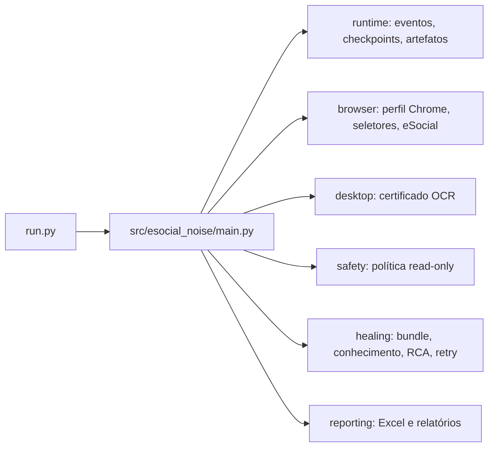

# Arquitetura modular local

## Limites de responsabilidade

| Módulo | Responsabilidade | Não faz |
| --- | --- | --- |
| `main` | Orquestra o ciclo e decide quando interromper | Não contém seletores ou OCR |
| `browser` | Chrome, Playwright e validação da tela eSocial | Não decide política |
| `desktop` | OCR do diálogo Windows, evidência e clique estritamente único | Não controla o navegador livremente |
| `safety` | Bloqueia escrita/transmissão e limita retries | Não executa ações |
| `runtime` | Eventos, checkpoints e artefatos auditáveis | Não conhece regra de eSocial |
| `healing` | Bundle, hipóteses, RCA e retry determinístico | Não altera seletor estável |
| `reporting` | Excel de entrada e saídas CSV/XLSX/MD | Não interage com eSocial |

## Invariantes

- Somente `ReadOnlyPolicy` autoriza um clique Web; textos que sugerem transmissão, envio, alteração, exclusão, assinatura, retificação ou salvamento são bloqueados.
- `CertificateOCR` exige janela Windows, evidência OCR, uma única ocorrência de `BIASON CONTABILIDADE` e uma única ocorrência de `OK`.
- Toda falha grava bundle com timeline, checkpoints, DOM, árvore acessível, screenshot, texto, URL e seletores tentados.
- Uma falha que torne o contexto incerto impede a consulta dos CPFs restantes.
- `runtime/state.py` grava `employee-state.json` de forma atômica após cada CPF; esse snapshot é para auditoria e retomada manual, nunca para pular validações.
